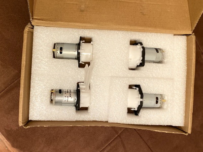
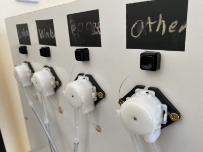
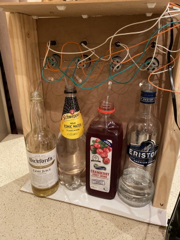
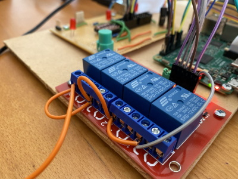
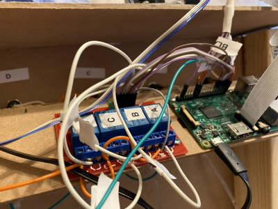

# 🍹 Cocktail Pi
Cocktails based on your mood created by a Raspberry Pi bartender

Build instructions for a fully automated home build cocktail maker. How to use a Raspberry Pi, camera plus a few peristaltic pumps assembled into a home bartender. 

Drinks are selected based on your emotion and multilingual voice prompts let you know when your drink is available. 🍸

For a complete video see [here](https://www.youtube.com/watch?v=8q_5STFzJ6c)

# Hardware Components

## Pumps
I used 4 [peristaltic pumps](https://en.wikipedia.org/wiki/Peristaltic_pump) to provide a "food safe" way to pump the liquids from the drink bottles




The pumps are mounted on a basic wooden frame higher than the tallest bottle


A view from the rear show the placement of pumpts and liquids



These are 12 volt motors. To operate them via the Raspberry Pi I used a [4 Channel 12V Relay Module](https://www.jaycar.com.au/arduino-compatible-4-channel-12v-relay-module/p/XC4440) 


The Raspberry Pi is mounted with the relay board



# Software

## Storing Recipes

[Recipes](./recipe.py) are stored as a map of ingredients with the number of millitres required for the perfect drink


```python
pump_map = {"PUMP_A": "Vodka", "PUMP_B": "Cranberry", "PUMP_C": "Tonic", "PUMP_D": "Lime"}

recipe_vodkasoda = {"Name": "Vodka Soda", "Vodka": 20, "Tonic": 70}
recipe_vodkasodacranburry = {"Name": "Vodka Soda Cranberry", "Vodka": 20, "Tonic": 70, "Cranberry": 40}
recipe_vodkalimesoda = {"Name": "Vodka Lime Soda", "Vodka": 20, "Tonic": 70, "Lime": 30}
recipe_limesoda = {"Name": "Lime Soda", "Tonic": 70, "Lime": 30}
recipe_test = {"Name": "Test", "Vodka": 10, "Cranberry": 20, "Tonic": 30, "Lime":40}
```

## Dispensing the perfect amount

The pumps I'm using dispense 1.9mL of liquid per second. I can deligate each pump to a thread timer so it knows how long to operate for once the drink is selected. Have a look at [pump.py](./pump.py) for complete code

```python
# Return the number of seconds to run
def lookup_time(drink_name, pump_name):
    ML_per_second = 1.9 
    num_ML = drink_name[pump_map[pump_name]]
    return num_ML / ML_per_second

# Run a pump for given number of seconds
def pump_thread_runner(gpio_pump_name, run_seconds):
    GPIO.output(gpio_pump_name, GPIO.HIGH)
    time.sleep(run_seconds)
    GPIO.output(gpio_pump_name, GPIO.LOW)

# Pick a drink
this_drink = recipe_vodkasoda

# How long to run each pump ...
duration_a = lookup_time(this_drink, "PUMP_A")
duration_b = lookup_time(this_drink, "PUMP_B")

# these threads start in background
pump_thread_start(config.gpio_pump_a, duration_a)
pump_thread_start(config.gpio_pump_b, duration_b)
```

## Emotion and Age
I use the [AWS Rekognition](https://aws.amazon.com/rekognition/) service to determine likely emotion and approximate age. Have a look at [cloud.py](./cloud.py) for complete code
```python
# Save camera image to file file_jpg
with picamera.PiCamera() as camera:
    camera.capture(file_jpg)

# Process file_jpg using AWS rekognition to extract emotion and age
with open(file_jpg, 'rb') as f_file_jpg:
    b_a_jpg = bytearray(f_file_jpg.read())
    rclient = boto3.client('rekognition')
    response = rclient.detect_faces(Image={'Bytes': b_a_jpg}, Attributes=['ALL'])
```

## Spoken words
For _text to speech_ I used the [AWS Polly](https://aws.amazon.com/polly/) service.  Have a look at [cloud.py](./cloud.py) for complete code

```python
# Using "Emma" as a voice, generate text to voice
voice='Emma'
client = boto3.client('polly')
response = client.synthesize_speech(OutputFormat='mp3', Text=audiotext, VoiceId=voice)    
thebytes = response['AudioStream'].read()
thefile = open(file_mp3, 'wb')
thefile.write(thebytes)
thefile.close()

# Play mp3 file via speaker
os.system('mpg123 -q {}'.format(file_mp3))
```
# Summary
A few hours and a bit of programming and you too can enjoy a 🍹 cocktail pi. Enjoy! 


